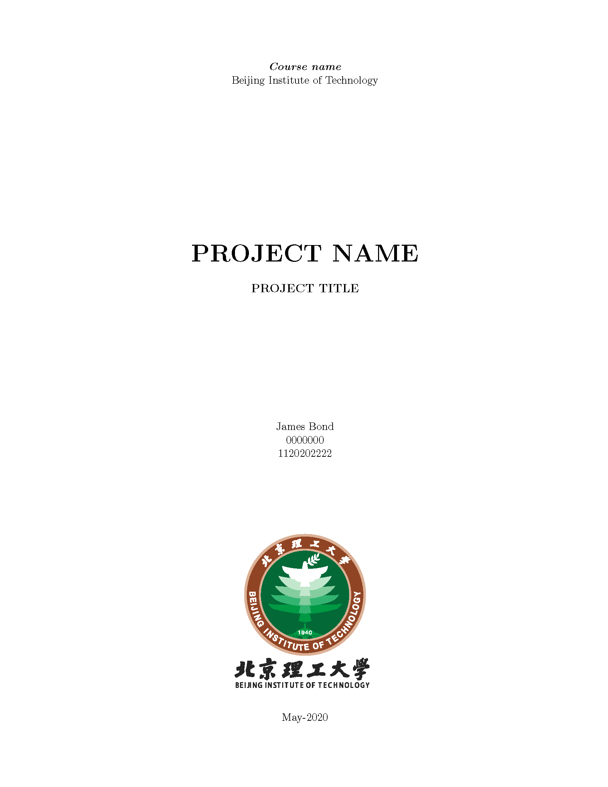
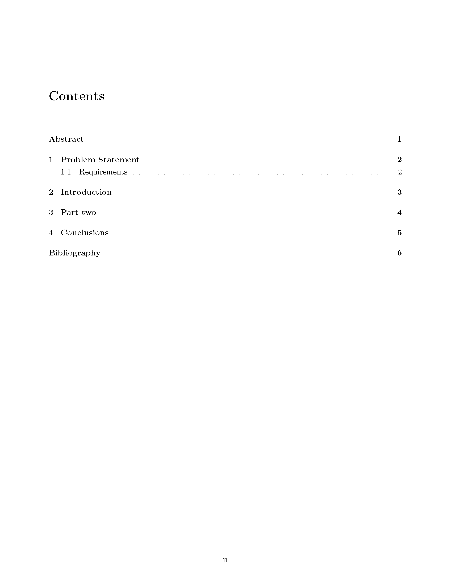
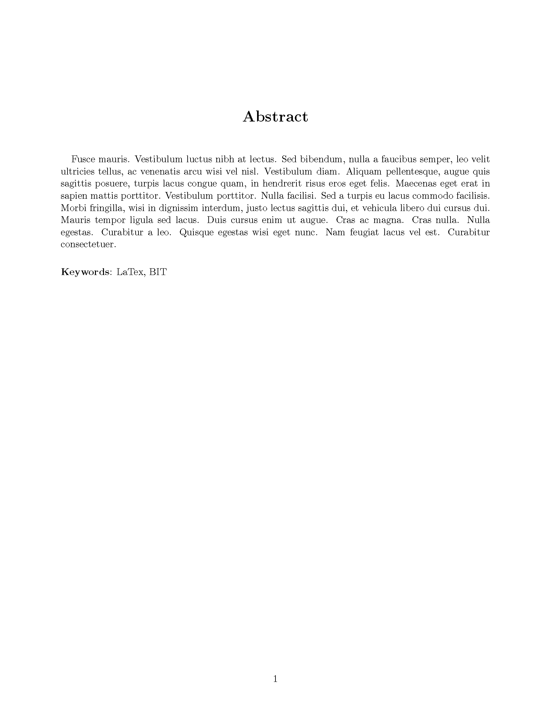
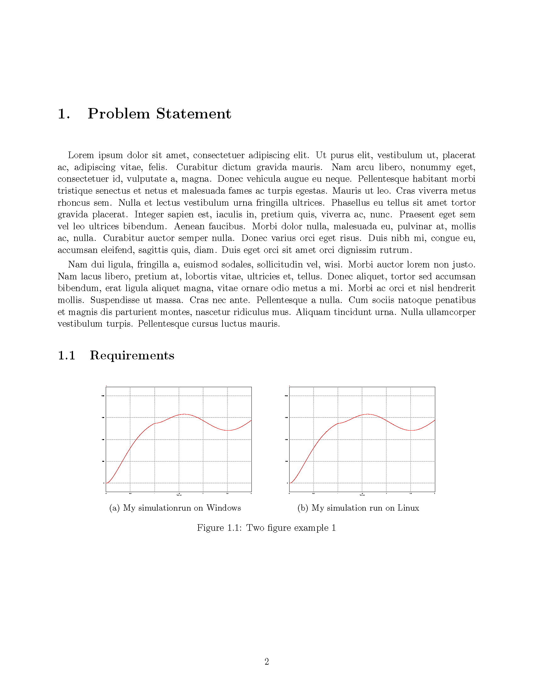
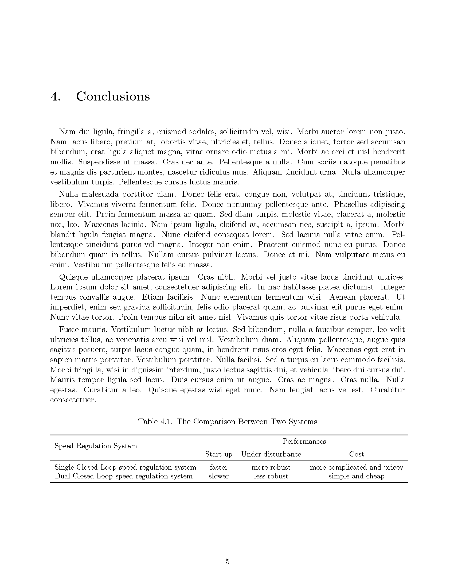

# 北京理工大学课程报告LaTeX模板

## 英文报告模板

### Overleaf 链接
[Overleaf](https://www.overleaf.com/latex/templates/beijing-institute-of-technology-report-template/szxqnwxtbcrb)

### 英文报告模板使用方法

1. 新建`/Figures` 文件夹内放置报告报告内的图片

2. 在 `main.tex` 内编辑报告内容

3. 在 `ref.bib` 中加入参考文献的 bibTeX

### 截图

[示例文件](https://github.com/CharlieLeee/BIT-Report-LaTeX/blob/master/English%20template/%E4%BE%8B%E5%AD%90.pdf)

## 中文报告模板

## TODO

1. 加入中文报告模板
