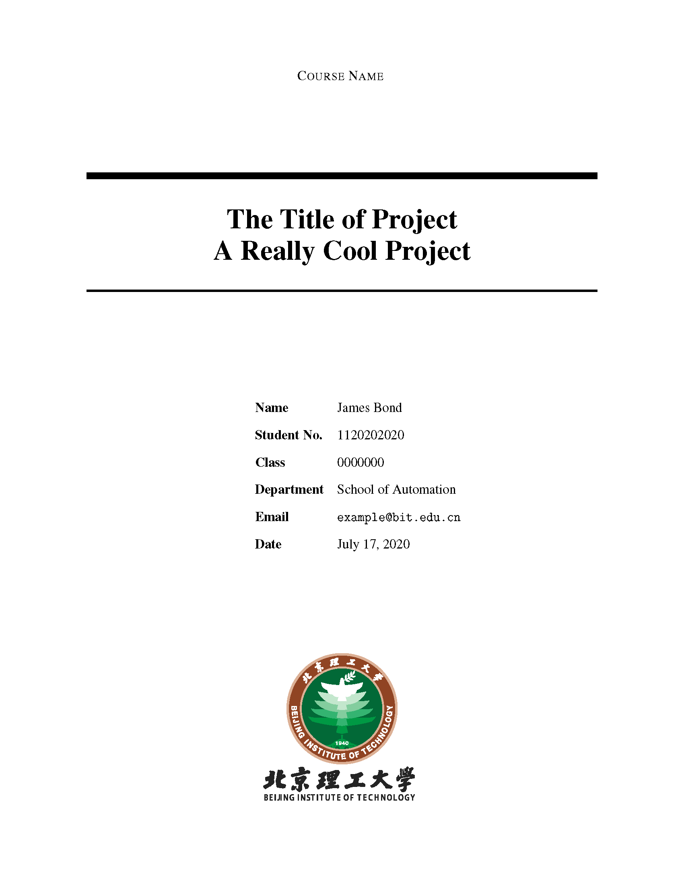
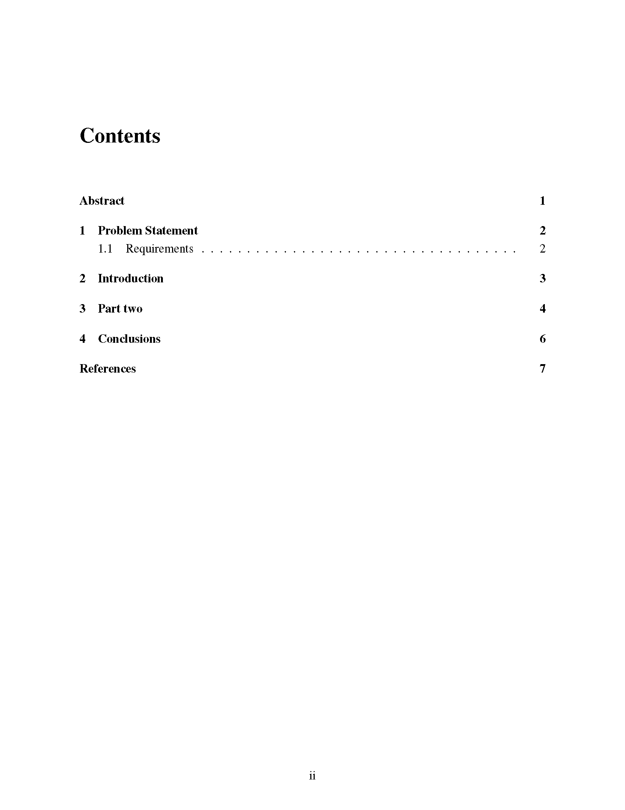
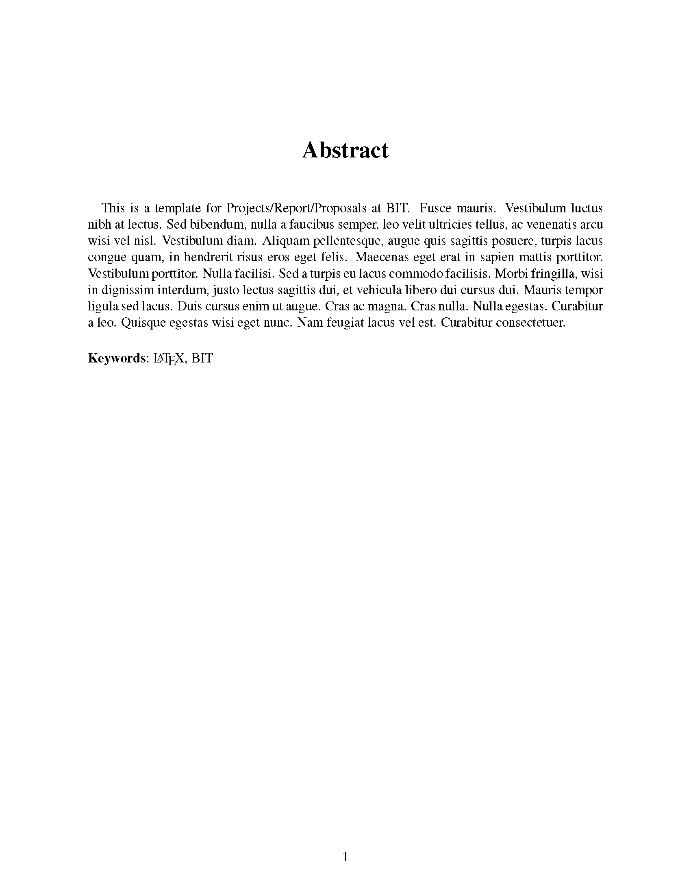
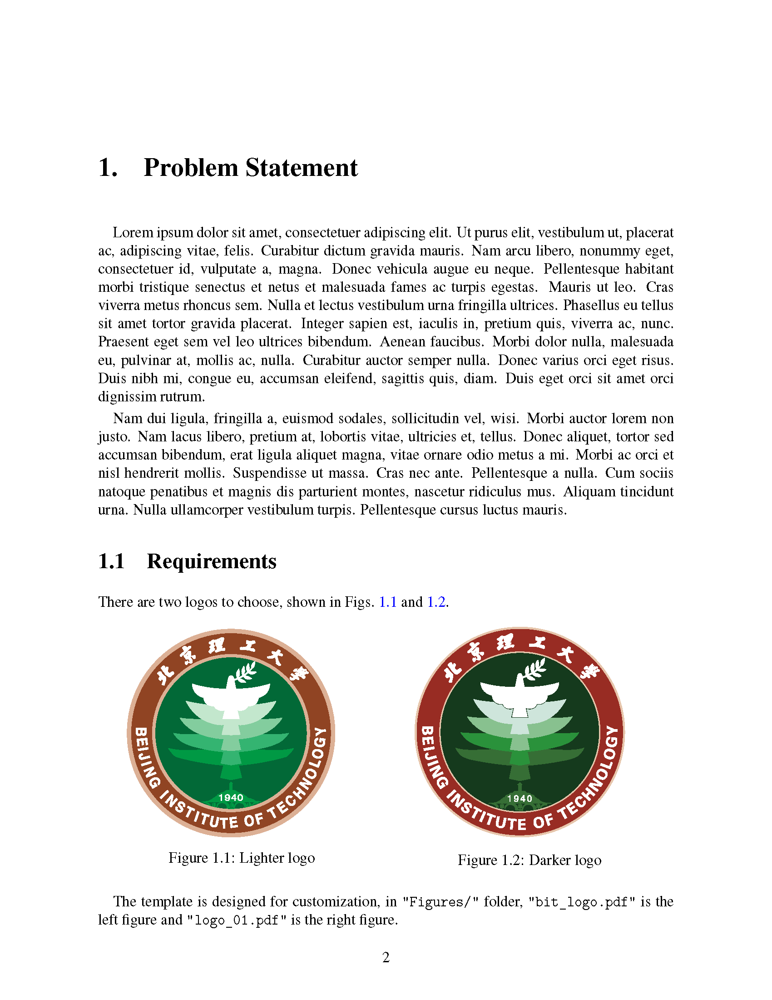
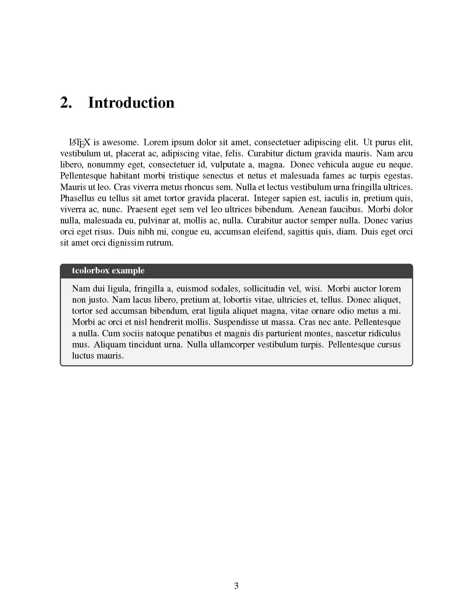
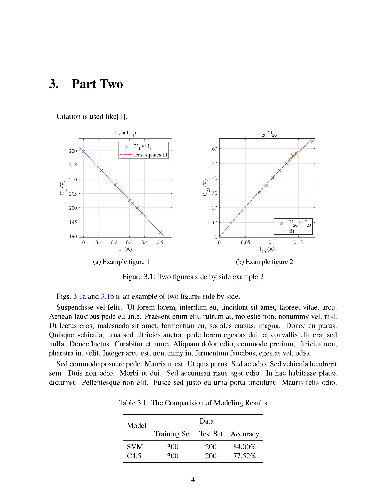
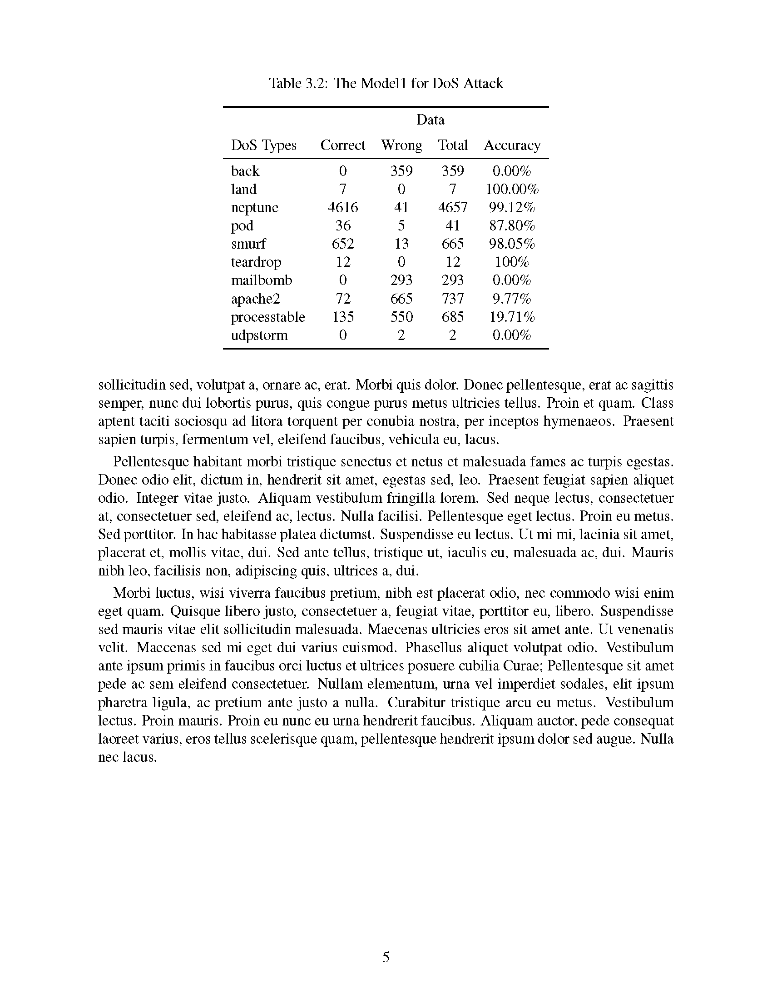
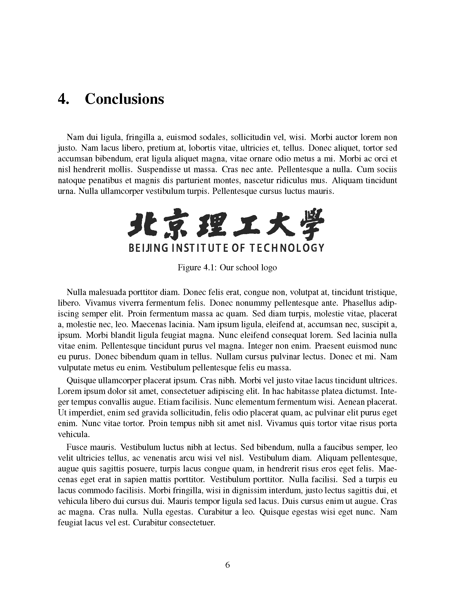
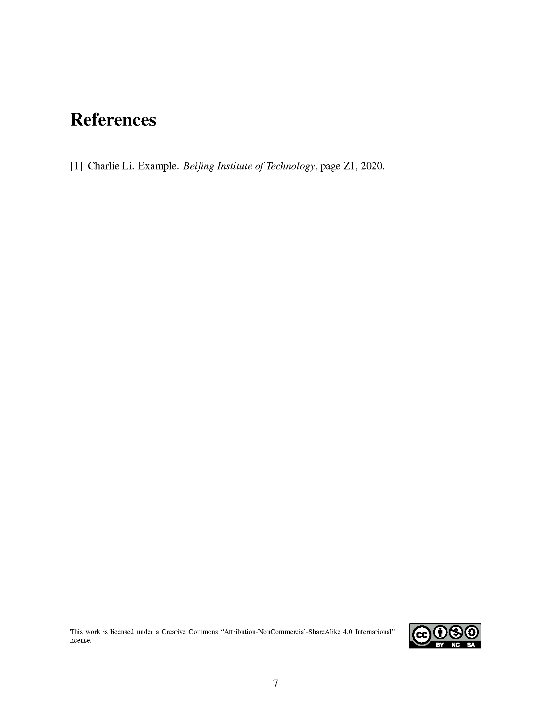
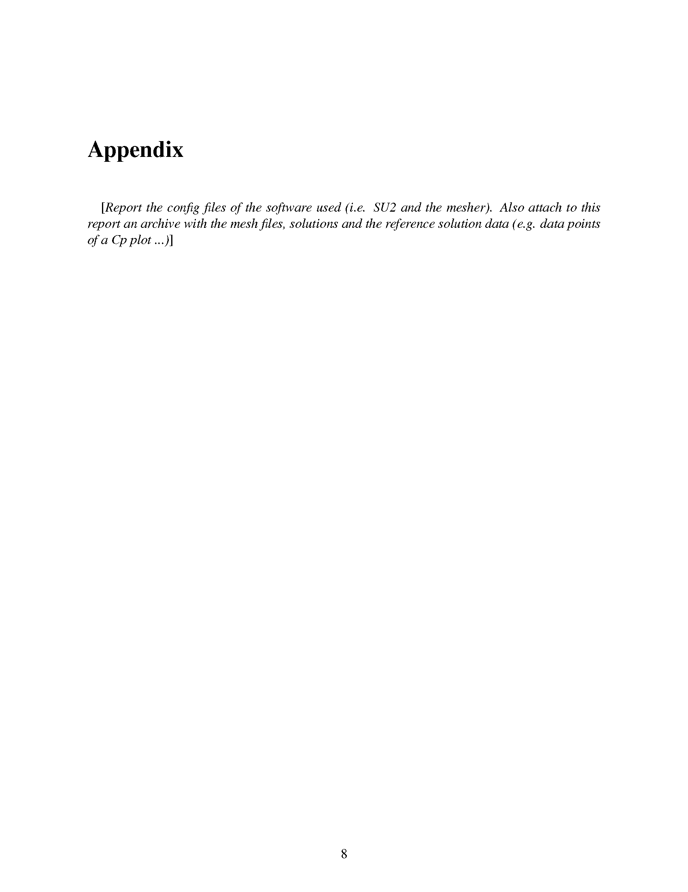

# LaTex templates for Beijing Institute of Technology

## English report

### Overleaf preview
[Overleaf](https://www.overleaf.com/latex/templates/beijing-institute-of-technology-report-template/szxqnwxtbcrb)

### Usage

1. place figures in the report in `/Figures` folder
2. edit  `main.tex` 
3. add bibTex of references in `ref.bib` 

### Screenshots

[PDF preview](https://github.com/CharlieLeee/BIT-Report-LaTeX/blob/master/English%20template/%E4%BE%8B%E5%AD%90.pdf)

## 中文报告模板

## TODO

1. 加入中文报告模板
